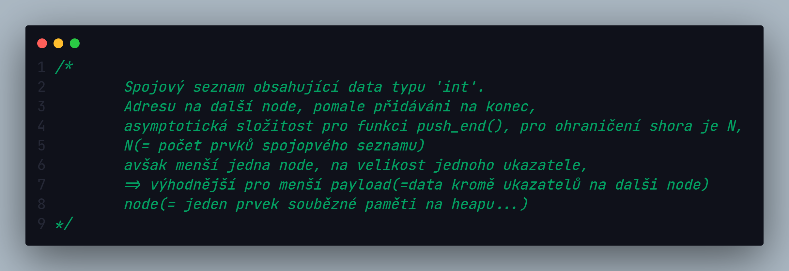
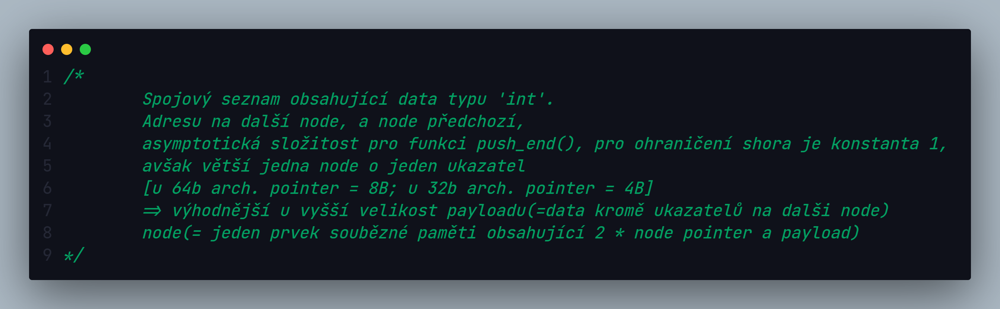
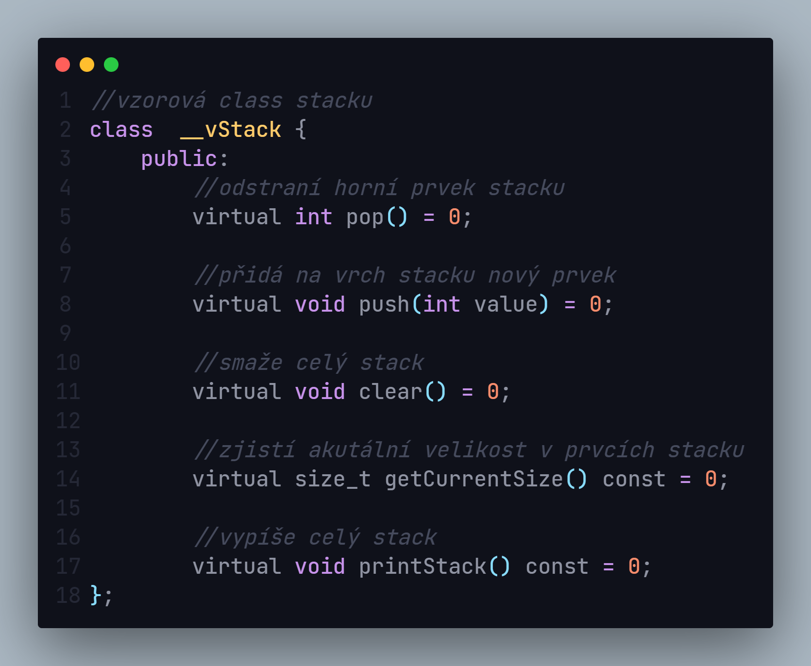

# DataStructure 🛠️

## Info

-Vytvořím v této **repository** datové strukoty, nýbrž třídy kde je lze impelementovat🔑
-Celá repository bude psána v jazyce **C++** a za pomoci **Visual Studia Professional 2022**

## Napsané datové struktury

### Singly Linked List

### Doubly Linked List

### Stack

